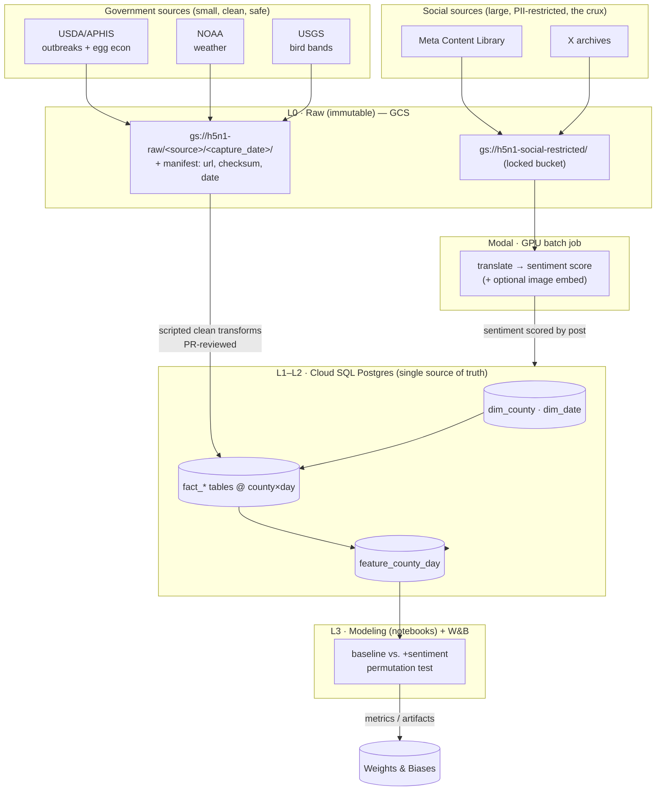
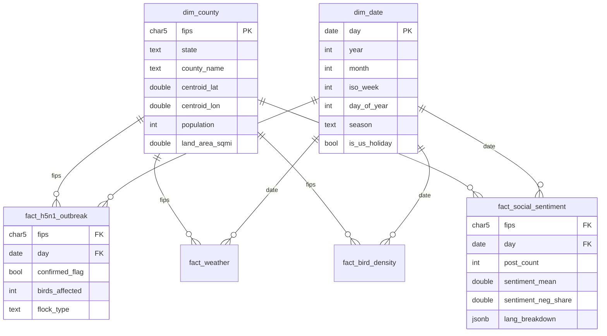

# H5N1 Capstone — Infrastructure Architecture Sketch

> Working design doc for the team (Nick, Waree, Max). Not final — a shared starting point to align on before writing ingestion code. Renders with diagrams on GitHub.

## 0. Decided vs. deferred

**Decided**
- Frozen data snapshot; **scripted, re-runnable** raw→clean (locked ≠ hand-pulled).
- Canonical grain: **county FIPS × calendar day**. Every fact table conforms to it.
- **Code in git; data never.** Raw lives in GCS, clean lives in Postgres.
- **Cloud SQL Postgres** = warehouse · **GCS** = immutable raw · **Modal** = scaled GPU jobs · **notebooks** (Colab / Vertex Workbench) = exploration · **W&B** = experiment tracking, switched on at the modeling phase.
- One shared **Docker image** + pinned deps for reproducibility.
- **GitHub + PR review** as the collaboration and teaching backbone.

**Deferred (pending facts)**
- Whether Meta terms permit storing the corpus in GCP at all → dictates the social-data storage box below.
- The image/CLIP branch (only if the corpus warrants it).
- W&B vs. self-hosted MLflow (final call at modeling phase).

---

## 1. End-to-end data flow



Layer contract:
- **L0 Raw** — dated, immutable, checksummed. Never edited. Re-runs read from here.
- **L1 Clean** — one conformed fact table per source, county×day grain, in Postgres.
- **L2 Features** — `feature_county_day`, the model-ready join of every source on `(fips, date)`.
- **L3 Outputs** — predictions + metrics, tracked in W&B; artifacts back to GCS/Postgres.

---

## 2. The Postgres schema — county×day star

The join model, made concrete. Two conformed dimensions; every source becomes a fact keyed to both. This is the schema decision that matters more than any tool choice.



Concrete DDL (abridged — full set lives in `sql/`):

```sql
-- Dimensions (conformed, shared by every fact)
CREATE TABLE dim_county (
    fips           CHAR(5) PRIMARY KEY,          -- state(2)+county(3), the geo backbone
    state          TEXT NOT NULL,
    county_name    TEXT NOT NULL,
    centroid_lat   DOUBLE PRECISION,
    centroid_lon   DOUBLE PRECISION,
    population     INTEGER,
    land_area_sqmi DOUBLE PRECISION
);

CREATE TABLE dim_date (
    day         DATE PRIMARY KEY,
    year        SMALLINT, month SMALLINT, iso_week SMALLINT,
    day_of_year SMALLINT, season TEXT, is_us_holiday BOOLEAN
);

-- Dependent variable: USDA/APHIS poultry detections
CREATE TABLE fact_h5n1_outbreak (
    fips            CHAR(5) REFERENCES dim_county,
    day             DATE     REFERENCES dim_date,
    confirmed_flag  BOOLEAN NOT NULL DEFAULT FALSE,
    birds_affected  INTEGER,
    flock_type      TEXT,                          -- commercial / backyard / turkey / layer ...
    PRIMARY KEY (fips, day, flock_type)
);

-- NOAA weather  |  USGS bird density  |  USDA egg economics — same shape, one per source
CREATE TABLE fact_weather (
    fips CHAR(5) REFERENCES dim_county,
    day  DATE     REFERENCES dim_date,
    temp_min_c DOUBLE PRECISION, temp_max_c DOUBLE PRECISION,
    precip_mm  DOUBLE PRECISION, humidity_pct DOUBLE PRECISION,
    PRIMARY KEY (fips, day)
);

-- Aggregated Modal output: sentiment rolled up to the canonical grain
CREATE TABLE fact_social_sentiment (
    fips CHAR(5) REFERENCES dim_county,
    day  DATE     REFERENCES dim_date,
    post_count          INTEGER,
    sentiment_mean      DOUBLE PRECISION,   -- [-1, 1]
    sentiment_neg_share DOUBLE PRECISION,
    lang_breakdown      JSONB,              -- {"en":0.7,"es":0.2,"fr":0.1}
    PRIMARY KEY (fips, day)
);

-- The model-ready join. Materialize for speed; LEFT JOIN so a missing source = NULL, not a dropped row.
CREATE MATERIALIZED VIEW feature_county_day AS
SELECT d.fips, d.day,
       COALESCE(o.confirmed_flag,FALSE) AS outbreak, o.birds_affected,
       w.temp_min_c, w.temp_max_c, w.precip_mm, w.humidity_pct,
       b.band_count_smoothed,
       s.post_count, s.sentiment_mean, s.sentiment_neg_share
FROM   (SELECT c.fips, dt.day FROM dim_county c CROSS JOIN dim_date dt) d
LEFT JOIN fact_h5n1_outbreak  o USING (fips, day)
LEFT JOIN fact_weather        w USING (fips, day)
LEFT JOIN fact_bird_density   b USING (fips, day)
LEFT JOIN fact_social_sentiment s USING (fips, day);
```

Two design notes that will save pain:
- **Crosswalks are their own step.** USGS lat/lon → FIPS and social geolocation → FIPS are explicit transforms in the clean layer, not afterthoughts. Bad crosswalks silently corrupt every downstream join.
- **`stg_*` staging tables** mirror the raw pull 1:1 before cleaning, so a cleaning bug is fixable without re-pulling from the source.

---

## 3. The notebook → Modal handoff

The whole trick: **one shared library, two entry points.** You never rewrite code to "productionize" — the notebook and the Modal job import the *same* functions. Only scale, I/O, and where it runs differ. This is the real-world pattern (prototype interactively → run as a reproducible batch job) and it's the single most transferable thing Waree and Max take from this.

```
h5n1/sentiment/core.py   ← pure functions, no I/O, no globals
        ▲                     load_model()
        │                     score_sentiment(texts) -> scores
        │                     translate(texts) -> texts_en
        │
   ┌────┴─────────────────────────┐
   │                              │
notebooks/explore.ipynb      modal_jobs/score.py
(Colab / Vertex Workbench)   (@app.function gpu=...)
small sample from Postgres   full corpus from GCS
eyeball, iterate             writes fact_social_sentiment
```

The shared core — written once, side-effect free:

```python
# h5n1/sentiment/core.py
def load_model(name="cardiffnlp/twitter-xlm-roberta-base-sentiment"): ...
def translate(texts: list[str]) -> list[str]: ...
def score_sentiment(texts: list[str], model=None) -> list[float]:
    """Pure: text in, [-1,1] scores out. No DB, no files."""
    ...
```

Exploration — interactive, tiny slice, disposable:

```python
# notebooks/explore.ipynb
from h5n1.sentiment.core import load_model, score_sentiment
sample = read_sql("SELECT post_id, text FROM stg_social_posts LIMIT 500")
sample["score"] = score_sentiment(sample["text"].tolist(), load_model())
sample.sort_values("score").head(20)   # do the emojis/hashtags behave? eyeball it
```

Production — same functions, wrapped for scale, reproducible, one command:

```python
# modal_jobs/score.py   →   run: modal run modal_jobs/score.py
import modal
app = modal.App("h5n1-sentiment")
image = modal.Image.debian_slim().pip_install_from_requirements("requirements.txt")

@app.function(gpu="A10G", image=image, timeout=3600)
def score_batch(posts: list[dict]) -> list[dict]:
    from h5n1.sentiment.core import load_model, translate, score_sentiment  # SAME code
    model = load_model()
    texts = translate([p["text"] for p in posts])
    scores = score_sentiment(texts, model)
    return [{**p, "score": s} for p, s in zip(posts, scores)]

@app.local_entrypoint()
def main():
    posts = read_all_posts_from_gcs()                 # full corpus
    results = list(score_batch.map(chunk(posts)))     # fan out across GPU workers
    write_scores_to_postgres(results)                 # → fact_social_sentiment
```

Because `explore.ipynb` and `score.py` call identical `core.py` functions, "it worked in the notebook" actually means it works in production. That's the payoff.

---

## 4. Repo layout

```
h5n1-capstone/
  README.md                 # clone-and-run instructions (the reproducibility deliverable)
  Dockerfile                # one shared image, written by Nick
  pyproject.toml            # pinned deps (the reproducibility floor)
  h5n1/                     # shared importable library
    sources/                #   raw pulls, one module per source
    clean/                  #   raw → conformed fact transforms
    sentiment/core.py       #   the pure functions above
    features/               #   builds feature_county_day
    models/                 #   model wrappers (ARIMAX, XGBoost, GRU, ...)
  ingest/                   # thin CLI entrypoints per source (Nick=USDA, Waree=NOAA, Max=USGS)
  modal_jobs/               # Modal app definitions
  notebooks/                # exploration — NOT the source of truth
  sql/                      # DDL + migrations
  manifests/                # snapshot manifests: url, checksum, capture_date
  .env.example              # documents required secrets; real .env is gitignored
```

---

## 5. The build sequence & who does what

1. **Nick builds USDA end-to-end** as the reference implementation: pull → GCS raw + manifest → `stg_` → `fact_h5n1_outbreak` (+ egg econ) → data-quality check. This is the template.
2. Waree takes **NOAA → fact_weather**, Max takes **USGS → fact_bird_density**, each following the template. Nick reviews via **PR** — that review *is* the teaching.
3. Build **`dim_county` / `dim_date`** first (everything FKs to them).
4. Social branch: raw → restricted GCS → **Modal scoring** → `fact_social_sentiment`.
5. Materialize **`feature_county_day`**.
6. **Modeling notebooks** pull features from Postgres → baseline vs. +sentiment → log to **W&B**.
7. **Permutation test**: shuffle the sentiment column, re-run, compare. The thesis lives here.

---

## 6. Governance (decide day one, cheap to do, expensive to skip)
- **Secrets:** `.env` gitignored + a shared secret store (or GCP Secret Manager). Never commit keys.
- **Cost:** GCP **budget alert** on day one; ask Muthu about sponsor/education cloud credits. GPU-hours are the cost risk, not the database.
- **Immutability + manifest:** raw is write-once; every snapshot has a manifest (source URL, checksum, capture date). This is what makes "reproducible framework" literally true.
- **Privacy:** no raw social posts in git or in any public output; report only aggregated, de-identified county×day features (matches your ethics section).
```
